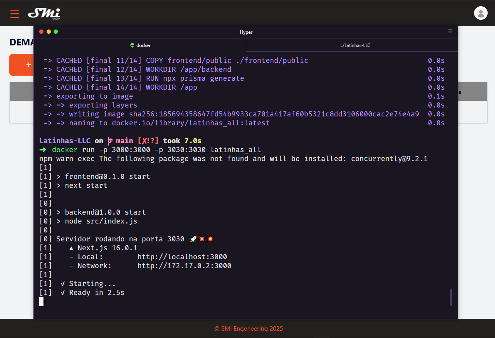
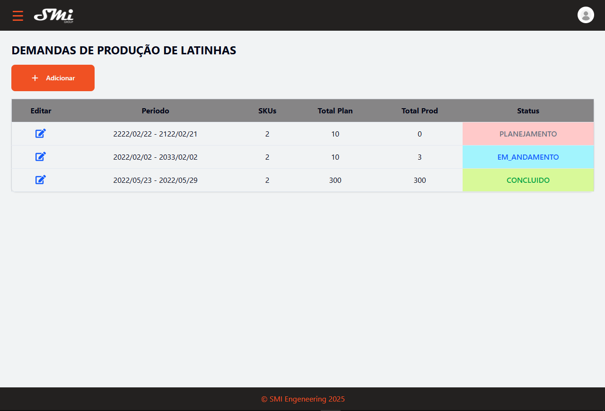
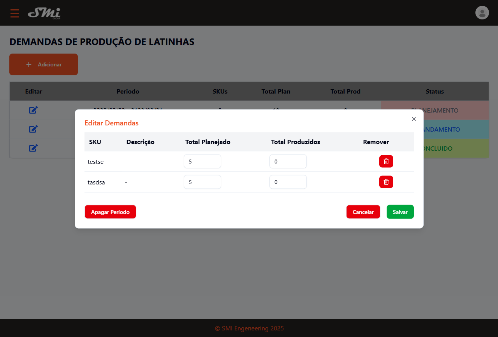

# 📋 Sobre o Projeto

'Latinhas-LLC' é uma empresa fictícia, onde é solicitada um sistema de planejamento de demandas. Este projeto tem vinculo com uma prova técnica para a empresa [SMI Group](https://smigroup.com.br).

Nesse sistema, é esperado o usuário conseguir criar demandas para um certo período de tempo/data definidos. Ao criar um periodo de demandas, conseguimos calcular o status da mesma, se está em planejamento, em andamento ou concluída. O usuário deve colocar quantas demandas de um certo produto ja foram produzidas, para o sistema calcular automaticamente o status do período. O período de demandas é customizável, podendo apagar demandas, alterar o valor produzido e alterar o valor planejado para ser produzido.

## ✨ Funcionalidades Principais

-   ✅ Gerenciamento de períodos de produção
-   ✅ Controle de demandas (SKU, planejamento e produção)
-   ✅ Status automático dos períodos (Planejamento, Em Andamento, Concluído)
-   ✅ Interface responsiva
-   ✅ CRUD completo de períodos e demandas
-   ✅ Dockerização da aplicação

# 🛠️ Tecnologias Usadas

Detalhando um pouco de tudo que usei para esse projeto, tecnologias, conhecimentos, frameworks:

## Backend

-   Node.js (v20.x) - Runtime JavaScript
-   Express - Framework web minimalista
-   Prisma ORM - ORM moderno para Node.js
-   SQLite - Banco de dados relacional leve
-   ES Modules - Módulos JavaScript modernos

## Frontend

-   Next.js (v15.x) - Framework React
-   React (v19.x) - Biblioteca para interfaces
-   TypeScript - Superset tipado do JavaScript
-   Tailwind CSS - Framework CSS utility-first
-   shadcn/ui - Componentes reutilizáveis
-   Lucide Icons - Biblioteca de ícones

## DevOps

-   Git - Controle de versão
-   Docker - Containerização da aplicação

# 🚀 Como rodar

## 🐳 Opção 1: Rodar com Docker (Recomendado para garantir 100% o funcionamente esperado)

1️⃣ Clone o repositório

```
git clone https://github.com/TitanCodeXD/Latinhas-LLC
cd latinhas-llc
```

2️⃣ Build da imagem Docker
Na raiz do projeto, execute:

```
docker build -t latinhas_all:latest .
```

Pode demorar um pouco a execução, mas é normal.

3️⃣ Executar o container
Execute, novamente na raiz do projeto

```
docker run -p 3000:3000 -p 3030:3030 latinhas_all
```

4️⃣ Acessar a aplicação
Após o último comando, o esperado é ele retonar um link, ao clicar você será redirecionado para a aplicação funcionando

```
Frontend: http://localhost:3000
Backend API: http://localhost:3030
```

5️⃣ Parar o container
Quando quiser parar a aplicação, basta pressionar 'Ctrl + C' no terminal onde o container está rodando.

📝 Observações sobre Docker

O container roda frontend (Next.js) e backend (Node.js) simultaneamente. certifique-se de que as portas 3000 e 3030 estão livres.

## 💻 Opção 2: Rodar Localmente (Desenvolvimento)

1️⃣ Clone o repositório

```
git clone https://github.com/TitanCodeXD/Latinhas-LLC
cd latinhas-llc
```

2️⃣ Instale as dependências do Backend

```
cd backend
npm install
```

3️⃣ Configure o banco de dados (Backend)

```
# Gerar Prisma Client
npx prisma generate

# Executar migrations (se necessário)
npx prisma migrate dev
```

4️⃣ Rodar o Backend

```
npm run dev
```

O backend estará rodando em http://localhost:3030

5️⃣ Instalar dependências do Frontend
Em outro terminal:

```
cd frontend
npm install
```

6️⃣ Rodar o Frontend

```
npm run dev
```

O frontend estará rodando em http://localhost:3000

# 🎨 Screenshots

## Tela da aplicação rodando com docker no terminal



## Tela inicial do projeto



## Tela de editar período podendo alterar o quanto foi produzido de alguma demanda e apagar



# 📄 Observações e Decisões

## Por que um único container no docker?

-   Decidir fazer apenas um container que englobe o Frontend e Backend pela facilidade tanto de buildar quanto de rodar em qualquer máquinas. Sei que não é a melhor opção, mas como estou em uma prova técnica, priorizei o simples mas efetivo. Em um projeto mais profissional é mais recomendado um container para cada lado da aplicação.

## Por que SQLite?

-   Bom, como o banco de dados do projeto era simples, um banco simples ja ia suprir a necessidade, sem precisar de um externo. Então eu não precisaria configurar. E bom, ele tem um arquivo único, facilita o entendimento também eu diria. Apesar de eu ser mais acostumado com um banco não relaciona (NoSQL - MongoDB), o SQLite é um dos bancos relacionais que mais tenho experiencia, e ele supre bem.

## Por que Prisma?

-   Eu já tinha um conhecimento básico do prisma, e ja tinha vistos uns colegas usando e achei super interessante, e vejo ele encaixando em projetos modernos, encaixaria bem com a parte do frontend (Next), que também tem coisas modernas.

## Por que Next?

-   Next é uma das tecnologias mais modernas atualmente, se adequar as tecnologias é estar atualizado com o mercado, eu ja tinha feito um projeto com next antes, gostei do jeito que ele funciona, bem otimizado, alem de ja vir integrado com outras tecnologias modernas, como Tailwind para CSS.
-

## Commits

-   Tentei deixar os commits organizados desde o ínicio do projeto. Não existe um padrão 100% correto, mas durante as pesquisas que fiz, o padrão que usei é um dos melhores para organização e clareza nos commits. Então, se quiser acompanhar um pouco do histórico do meu projeto, recomendo conferir um pouco meus commits :)

## Histório do meu raciocinio

-   Há alguns controllers dos quais eu construí no começo do projeto, pois tinha setado uma ideia de projeto, mas conforme foi mudando eu acabei não usando eles no fim das contas, ficou mais como um uso de backend/manutenção. Seria o ideal apagar as coisas que não estão sendo utilizadas para um código mais limpo, mas acho que para esta prova é interessante manter todo meu histórico de raciocínio e as ideias que tive durante o processo, mesmo que algumas coisas não fossem aproveitadas no projeto final/integrado com o frontend.

## 🙏 Agradecimentos

Este projeto foi desenvolvido como parte de uma prova técnico para a [SMI Group](https://smigroup.com.br).
